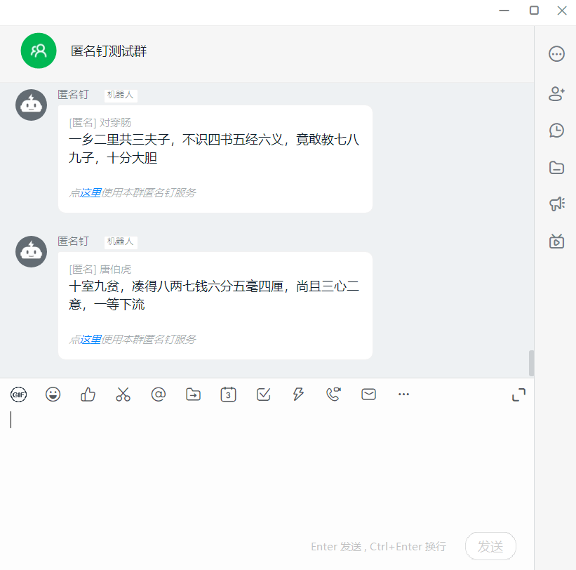
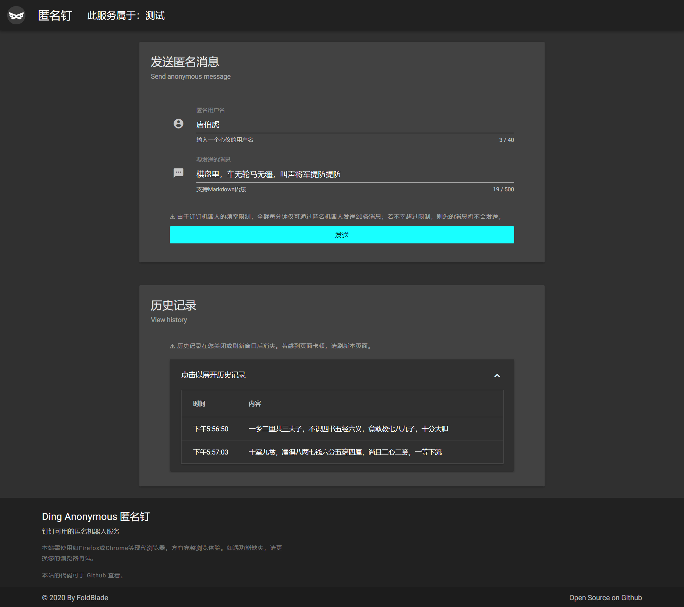
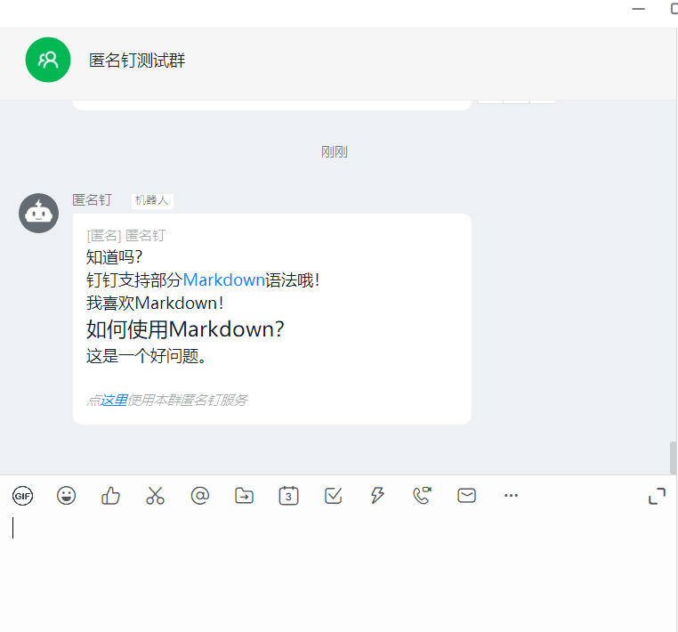

# DingAnonymous - 匿名钉

钉钉可用的群聊匿名机器人。

## 缘起

由于COVID-2019，返校日期一拖再拖，各类课程也全面搬到了线上。

我有一门课使用的是QQ群视频。但最近有同学反映会卡顿、字小的Word文档无法在群视频的分享屏幕中看清，同时还存在着无法回看的问题。

老师便决定试用钉钉——但随之而来的问题是，这位老师并不反对我们匿名——于是上课时的QQ群中，我们便都用匿名身份来和老师交互。对学生来说，匿名不会有什么回答错误被批评的心理压力；对老师来说，允许学生匿名回答问题，实在是网课情况下了解学生上课状态的一招妙计。

为了让可能遇到卡顿的同学也能顺利流畅的上课，也为了匿名回答问题这一课堂模式，鄙人用半个下午的时间写出了这个匿名钉。

目前，“匿名钉”还是需要打开浏览器进行使用（很遗憾，钉钉机器人不可以私聊、也不可以@回复），同时由于钉钉的机器人消息频率限制，每分钟内钉钉群中机器人只能发送20条消息。

## 特性与截图

- 通过钉钉群机器人以实现钉钉群匿名聊天的功能

## 安装

### 开始之前……

- 您需要有一些网络建站的基g/础知识
- 您需要有一台可以公网访问的服务器

### 安装使用

1. 建立一个网站根目录📂
2. git clone 到网站根目录，或前往release页面下载后上传📤
3. 拷贝`.config.json.bak`为`.config.json`，并根据说明进行编辑📝
4. 访问您的网站，开始享受钉钉群内的匿名生活😀

## 参考&致谢

- 钉钉开放平台文档 - [群机器人](https://ding-doc.dingtalk.com/doc#/serverapi2/qf2nxq/26eaddd5)

- 使用了[MDUI](https://www.mdui.org/)的样式

